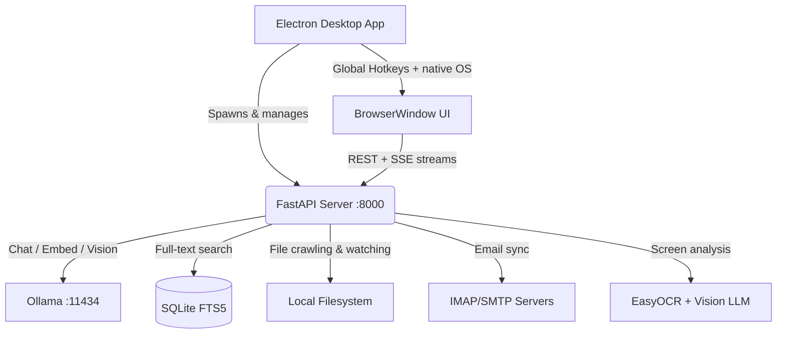
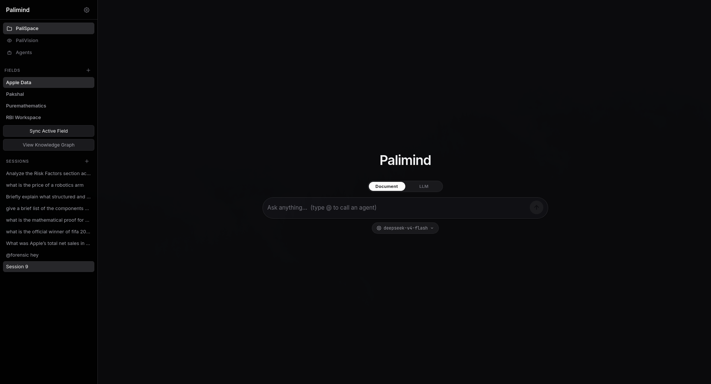

<div align="center">

#  PaliMind
> 📸 


### Local-First AI Intelligence OS — Private, Powerful, and Entirely On Your Machine.

[](https://www.python.org)
[](https://nodejs.org)
[](https://www.electronjs.org/)
[](https://ollama.com)
[](https://fastapi.tiangolo.com)
[](LICENSE)

**Index documents · Chat with a local LLM · Manage email · Analyze your screen · All 100% offline.**

[PaliSpace](#-palispace--the-ai-workspace) · [PaliMail](#-palimail--ai-email-assistant) · [PaliVision](#-palivision--screen-aware-ai) · [Setup](#️-installation)

</div>

---

## 🌐 Overview

PaliMind is an open-source, **local-first AI platform** that brings a full suite of AI productivity tools to your desktop — without requiring any cloud subscription or sending a single byte to an external server.

It bundles three standalone AI products under one unified CLI and desktop UI:

| Product | What it does | Hotkey |
|---|---|---|
| **🗂 PaliSpace** | Multimodal RAG workspace — index and chat with your local documents | `Ctrl + Shift + Space` |
| **📧 PaliMail** | AI-powered local email client — IMAP/SMTP with AI triage and smart drafting | `Ctrl + Shift + E` |
| **👁 PaliVision** | Screen-aware AI — capture your screen and ask questions about it | `Ctrl + Shift + V` |

All inference runs locally via **Ollama**. No OpenAI. No Anthropic. No cloud.

---

## 🏗 Architecture

PaliMind is built on a dual-layer architecture: a **Python/FastAPI backend** for all AI/ML heavy lifting, wrapped inside an **Electron desktop shell** for native OS integration.



### Communication Flow

1. **Electron** discovers the `.venv` Python environment and spawns the FastAPI server.
2. **FastAPI** binds on `http://127.0.0.1:8000` and exposes REST + SSE endpoints.
3. **Electron** polls the port until healthy, then loads `/ui` inside a sandboxed `BrowserWindow`.
4. The **Vanilla JS frontend** communicates via REST calls and SSE for real-time streaming.

---

## 🗂 PaliSpace — The AI Workspace

PaliSpace is the core RAG (Retrieval-Augmented Generation) engine. Point it at any folder on your machine, and it indexes every document into a local vector store you can query in natural language.

### Screenshots

<!-- HOW TO ADD SCREENSHOTS
  1. Take a screenshot of the PaliSpace desktop UI (pm ui).
  2. Drag & drop the image file into this GitHub page in Edit mode,
     or upload it to a folder like docs/assets/ and reference it below.
  3. Replace the placeholder line with:
       
     or use a GitHub-hosted URL:
       
-->

> 📸 

### Use Cases

- Chat with your codebase, research papers, or project notes
- Compare multiple documents side-by-side
- Get AI summaries and timelines extracted from financial or legal documents
- Run a private "second brain" with persistent episodic memory across sessions

### Key Features

| Feature | Details |
|---|---|
| **Multimodal Indexing** | Parses PDF, DOCX, PPTX, XLSX, images, Markdown, code files, and more |
| **Local Vector Store** | TurboVec (4-bit quantized) embeddings stored in SQLite — zero external DB |
| **Agent Swarm** | Orchestrates specialized agents: Researcher, Comparator, Advisor, Timeline, Document |
| **Episodic Memory** | Conversation turns are embedded and retrieved for long-term context |
| **Session Management** | Multiple persistent chat sessions per workspace with mid-term summaries |
| **AI Agents** | Built-in Research, Compare, Advise, Swarm, and Document agents — plus custom agents |
| **Web Search** | Integrated DuckDuckGo search + Scrapling for real-time context augmentation |
| **Voice I/O** | Speech-to-Text (Faster-Whisper) and Text-to-Speech (Kokoro-ONNX) |

### How to Use

#### 1. Initialize a Workspace (Field)

```bash
pm init /path/to/your/project
pm add /path/to/your/project
```

#### 2. Chat via CLI

```bash
pm ask "What are the key findings in the Q3 report?"
pm chat
pm swarm "Summarize all legal risks across these contracts"
pm document report.pdf "Extract all financial figures"
```

#### 3. Desktop UI

```bash
pm ui   # Launch the full Electron desktop app
```

The desktop UI provides:
- **Fields panel** — add/switch between indexed workspaces
- **Chat panel** — real-time streaming chat with agent selector
- **File explorer** — browse and filter indexed documents
- **Sessions sidebar** — manage and restore previous conversations

#### 4. Hotkey Capture

```bash
pm hotkey start
pm hotkey start --hotkey alt+shift+c
pm hotkey trigger
```

### Supported File Types

| Category | Extensions |
|---|---|
| Documents | `.pdf`, `.docx`, `.pptx`, `.xlsx` |
| Code & Text | `.py`, `.js`, `.ts`, `.go`, `.rs`, `.c`, `.cpp`, `.md`, `.txt` |
| Data | `.json`, `.yaml`, `.toml`, `.csv` |
| Images | `.png`, `.jpg`, `.jpeg`, `.webp` (OCR extracted) |

---

## 📧 PaliMail — AI Email Assistant

PaliMail is a **fully local, terminal-first email client** with AI-powered triage. All emails are stored in `~/.palimind/email.db` (SQLite). IMAP/SMTP credentials are encrypted on disk with **Fernet AES-128** — they never leave your machine.

### Screenshots

<!-- HOW TO ADD SCREENSHOTS
  1. Run `pm email list` or `pm email read <ID>` in your terminal.
  2. Take a screenshot of the terminal output.
  3. Upload the image and replace the placeholder below with:
       
-->

> 📸 

### Use Cases

- Manage multiple email accounts from the terminal
- Automatically get AI summaries, priority scores, and spam detection for every email
- Draft replies and compose new emails using Ollama AI — just describe your intent
- Full-text search across all your emails locally with BM25 ranking

### Key Features

| Feature | Details |
|---|---|
| **Multi-account** | Add unlimited IMAP/SMTP accounts with individual sync |
| **Encrypted credentials** | Fernet symmetric encryption, key bound to your machine |
| **AI Triage** | Each email gets: summary, priority score (1–5), spam score, and tags |
| **AI Drafting** | Compose or reply with an intent string — Ollama writes the draft |
| **BM25 Search** | Fast full-text search across subject, body, sender |
| **Incremental sync** | Only fetches new emails since last UID — no re-downloading |
| **Thread view** | `pm email read <ID> --thread` shows full conversation |

### How to Use

#### Account Setup

```bash
pm email add \
  --label "Gmail" \
  --email you@gmail.com \
  --imap-host imap.gmail.com \
  --smtp-host smtp.gmail.com \
  --smtp-port 587

pm email accounts
```

#### Sync & Browse

```bash
pm email sync
pm email sync --account Gmail
pm email sync --full

pm email list
pm email list --sort priority
pm email unread
pm email unread --count
```

#### Read & Search

```bash
pm email read 42
pm email read 42 --thread
pm email search "invoice Q3"
pm email search "meeting" --after 2025-01-01
```

#### Compose & Reply

```bash
pm email compose \
  --account Gmail \
  --to colleague@example.com \
  --subject "Project Update" \
  --ai-draft "brief update on the RAG milestone, mention Friday deadline"

pm email reply 42 --ai-draft "politely decline and suggest Friday instead"

pm email compose --account Gmail --to friend@example.com --subject "Hey"

pm email remove Gmail
```

---

## 👁 PaliVision — Screen-Aware AI

PaliVision is PaliMind's **screen analysis engine**. It captures your current screen, runs OCR and an optional vision LLM, then streams a contextual AI response — all locally.

### Screenshots

<!-- HOW TO ADD SCREENSHOTS
  1. Open the PaliVision / Glance panel via `pm ui`.
  2. Capture your screen and ask a question — screenshot the result.
  3. Upload the image and replace the placeholder below with:
       
-->

> 📸 

### Use Cases

- "What's wrong with this error message?" — ask AI about any visible error
- "Summarize what's on my screen" — instantly get a digest of any content
- Debugging assistance without copy-pasting error logs
- Accessibility helper — describe UI elements on screen

### Key Features

| Feature | Details |
|---|---|
| **OCR Extraction** | EasyOCR extracts all visible text from a screenshot |
| **Vision LLM** | Optionally calls LLaVA or Moondream for rich visual description |
| **SSE Streaming** | Streams response tokens in real-time — no waiting for full answer |
| **Web Search** | Augment screen context with live DuckDuckGo results |
| **Session Persistence** | Saves each screen conversation to `~/.palimind/glance_sessions.json` |
| **Episodic Memory** | Screen analysis turns are embedded into global long-term memory |
| **Multi-turn Chat** | Maintains conversation history across follow-up questions |
| **Model-aware** | Dynamically reads `ollama_base_url` from config — works with LocalTunnel |

### How to Use

PaliVision is accessible through the **PaliSpace desktop UI** under the `Glance` view:

1. Launch the desktop app with `pm ui`
2. Navigate to the **PaliVision / Glance** panel
3. Click **Capture Screen** — the screenshot is sent to the backend
4. Type your question in the chat box
5. The AI analyzes OCR text + visual description and streams a response


---

## ⚙️ Installation

### Prerequisites

| Requirement | Version | Notes |
|---|---|---|
| Python | 3.10+ | Core backend |
| Node.js | 18+ | Electron desktop wrapper |
| Ollama | Latest | Local LLM inference engine |

### 1. Install Ollama

```bash
# macOS / Linux
curl -fsSL https://ollama.com/install.sh | sh
```

> Windows — download from [ollama.com/download](https://ollama.com/download)

### 2. Pull Required Models

```bash
ollama pull nomic-embed-text
ollama pull gemma4:e2b
ollama pull llava
ollama pull moondream
```

### 3. Python Setup

```bash
git clone https://github.com/your-username/palimind.git
cd palimind

python -m venv .venv
source .venv/bin/activate
# Windows: .venv\Scripts\activate

pip install -e .
pip install -e ".[hotkey]"
```

### 4. Node.js / Electron Setup

```bash
npm install
```

### 5. Launch

```bash
pm ui
# or headless
pm chat
```

---

## ☁️ No GPU? Don't worry, Use Google Colab

If you don't have a local GPU, you can run the Ollama inference backend on a free Google Colab runtime and tunnel it to PaliMind on your local machine.

**→ See the setup script: [`colab_setup.py`](./colab_setup.py)**

The script:
1. Installs Ollama on the Colab runtime
2. Pulls all required PaliMind models
3. Exposes port `11434` publicly via LocalTunnel
4. Prints the public URL to paste into your PaliMind `config.json` as `ollama_base_url`

---

## 🛠 Tech Stack

| Layer | Technology |
|---|---|
| **Desktop Shell** | Electron, Node.js |
| **Backend** | Python 3.10+, FastAPI, Uvicorn |
| **CLI** | Typer, Rich |
| **AI / Inference** | Ollama (Gemma, LLaVA, Moondream, nomic-embed-text) |
| **Embeddings** | Sentence-Transformers, TurboVec (4-bit quantized) |
| **STT / TTS** | Faster-Whisper, Kokoro-ONNX |
| **OCR** | EasyOCR |
| **Database** | SQLite with FTS5 |
| **Frontend** | Vanilla JS, HTML, CSS |
| **Encryption** | Fernet (AES-128, cryptography library) |

---

## 👥 Team / Contributors

| Name | Role |
|---|---|
| **Pakshal Gada** | PaliSpace · RAG Model Architecture |
| **Pratham Kataria** | PaliVision · Desktop App (Electron) |
| **Om Upadhyay** | PaliMail · TUI |
| **Manthan Chheda** | Hotkey Implementation |
| **Janak Gohil** | UI Polishing |

> PaliMind is an open-source project. Contributions are very welcome!

---

## 🤝 Contributing

1. Fork the repository
2. Create your feature branch: `git checkout -b feature/your-feature`
3. Commit your changes: `git commit -m 'feat: add amazing feature'`
4. Push to the branch: `git push origin feature/your-feature`
5. Open a Pull Request

> **Note:** Core backend changes should degrade gracefully when Ollama is not running.

---

## 📄 License

Distributed under the **MIT License**. See [`LICENSE`](LICENSE) for full details.

---

<div align="center">

Built with ❤️ for privacy-first AI — no cloud, no subscriptions, no data leaks.

</div>
