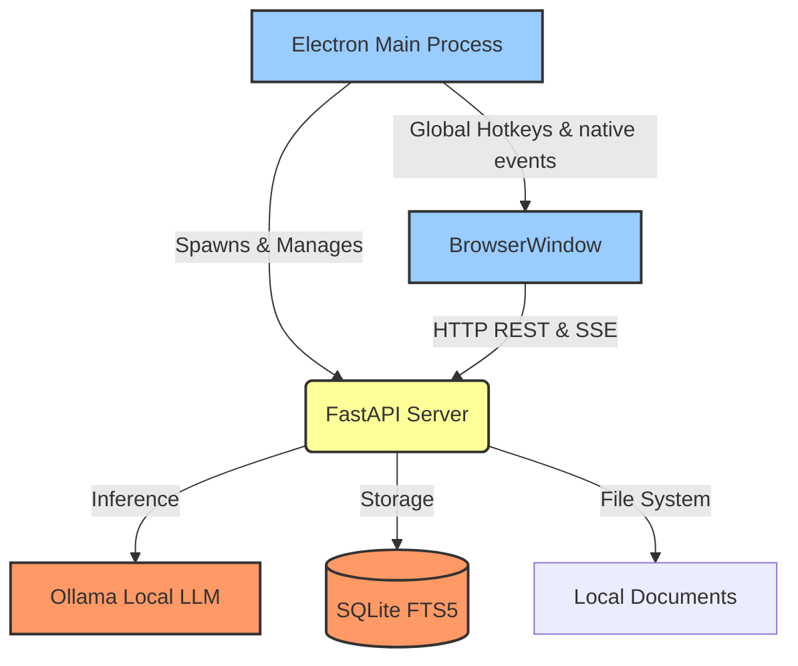

# PaliMind

> **Local-first intelligence OS** — index documents, chat with a local LLM, manage email entirely on your machine, and capture knowledge seamlessly via global hotkeys. No cloud. No subscriptions. No data leaving your device.

[](https://www.python.org)
[](https://nodejs.org)
[](https://www.electronjs.org/)
[](https://ollama.com)
[](LICENSE)

---

## 🚀 Features

- **Desktop AI Workspace** — A secure Electron desktop wrapper that automatically manages the background FastAPI server and renders a responsive Vanilla JS frontend.
- **Cross-Platform Global Hotkeys** — Toggle the interface instantly (`Ctrl+Shift+Space` on Windows/Linux, `Cmd+Shift+Space` on macOS) and capture context without interrupting your workflow.
- **Multimodal RAG** — Semantic search over personal files (PDF, PPTX, XLSX, images, and code) using local embeddings.
- **Smart Email Client** — Full IMAP/SMTP client with AI triage, needs-reply detection, spam filtering, and smart drafting.
- **Voice Engine** — Built-in Speech-to-Text (Faster-Whisper) and Text-to-Speech (Kokoro-ONNX) for hands-free interactions.
- **100% Local Privacy** — All inference is done via [Ollama](https://ollama.com); your data is never sent to external APIs. Credentials are encrypted via Fernet AES-128.

---

## 🏗 Architecture

PaliMind operates a dual-layer architecture: a **Python/FastAPI Backend** for heavy ML/RAG lifting, and an **Electron/Node.js Wrapper** for native desktop integration.



### Communication Flow

1. **Electron** discovers the local Python virtual environment and spawns `python -m core.api_server`.
2. **FastAPI** binds to `http://127.0.0.1:8000`.
3. **Electron** polls the port until healthy, then loads the UI (`/ui`) inside a secure, sandboxed `BrowserWindow`.
4. The **Frontend** communicates with the backend via REST APIs and Server-Sent Events (SSE) for streaming text and TTS.

---

## 🛠 Tech Stack

| Component           | Technology                                                                      |
| ------------------- | ------------------------------------------------------------------------------- |
| **Frontend**        | Vanilla JS, HTML, CSS (Served statically via FastAPI)                           |
| **Backend**         | Python 3.10+, FastAPI, Uvicorn, Typer (CLI)                                     |
| **Desktop Wrapper** | Electron, Node.js                                                               |
| **AI / Inference**  | Ollama, Sentence-Transformers, Faster-Whisper (STT), Kokoro-ONNX (TTS), EasyOCR |
| **Database**        | SQLite with FTS5 (Full-Text Search)                                             |

---

## 📂 Project Structure

```text
palimind/
├── core/                  # Python backend logic
│   ├── api_server.py      # FastAPI entrypoint
│   ├── cli/               # CLI command definitions (pm init, pm email)
│   ├── email/             # IMAP/SMTP logic, AI triage, local SQLite storage
│   ├── retrieval/         # RAG search, embeddings, document chunking
│   ├── generative/        # Agent routing and LLM streaming
│   └── config.py          # Environment settings and defaults
├── electron/              # Node.js Desktop application
│   └── main.js            # Process orchestration, hotkeys, lifecycle management
├── ui/                    # Frontend UI assets
│   ├── static/            # CSS, JavaScript (app.js, email.js, hotkey.js)
│   └── template/          # HTML templates
├── package.json           # Electron dependencies & scripts
├── pyproject.toml         # Python dependencies & CLI entrypoints
└── tests/                 # Unit and integration tests
```

---

## ⚙️ Installation

### 1. Prerequisites

- **Python 3.10+**
- **Node.js v18+**
- **Ollama** installed locally

### 2. Python Setup (Backend & CLI)

Create and activate a virtual environment, then install the package:

```bash
python -m venv .venv
source .venv/bin/activate  # On Windows: .venv\Scripts\activate

# Install core package
pip install -e .

# Optional: Install with Hotkey & OCR support
pip install -e ".[ocr,hotkey]"
```

### 3. Electron Setup (Desktop UI)

Install the Node dependencies for the wrapper:

```bash
npm install
```

### 4. Pull Local Models

PaliMind relies on Ollama for all AI operations. Pull the required models:

```bash
ollama pull nomic-embed-text   # For document embeddings (required)
ollama pull gemma4:e2b         # For chat / RAG queries (required)
ollama pull gemma3:latest      # For email AI (optional but recommended)
ollama pull llava              # For vision / image OCR (optional)
```

---

## 💻 Running the Application

### Desktop Mode (Recommended)

You can launch the complete Desktop application using the Palimind CLI:

```bash
pm ui
```

_Note: This command automatically executes `npm start`, launching the Electron wrapper, starting the FastAPI backend, and presenting the UI window._

**Global Hotkeys:**
Once running, you can toggle the app visibility from anywhere using:

- **Windows / Linux:** `Ctrl + Shift + Space`
- **macOS:** `Cmd + Shift + Space`

### CLI Mode

Palimind offers a powerful command-line interface for headless usage:

```bash
pm init .                               # Initialize the RAG index in current directory
pm add .                                # Index all files recursively
pm ask "How does auth work?"            # Single RAG question
pm chat                                 # Interactive terminal chat session
```

---

## 📧 Email Assistant Workflows

PaliMind includes a complete local-first email client. All emails are stored in `~/.palimind/email.db` and credentials are encrypted.

### Account Setup

```bash
# Add a Gmail account (requires an App Password)
pm email add \
  --label "Gmail" \
  --email you@gmail.com \
  --imap-host imap.gmail.com \
  --smtp-host smtp.gmail.com \
  --smtp-port 587
```

### Syncing & Reading

```bash
pm email sync                              # Sync all accounts and run AI summaries
pm email list --sort priority              # List emails sorted by AI priority
pm email read 42                           # Read email #42
pm email search "invoice"                  # Local SQLite FTS search
```

### Smart Drafting

```bash
# Draft a reply via Ollama
pm email reply 7 --ai-draft "politely decline and suggest Friday instead"
```

---

## 🔧 Environment Variables & Configuration

PaliMind stores its configuration in `~/.palimind/config.json` (or `.palimind/config.json` in the active directory).

**Key Configuration Defaults:**

```json
{
  "embed_model": "nomic-embed-text",
  "chat_model": "gemma4:e2b",
  "ollama_base_url": "https://chubby-camels-design.loca.lt",
  "chunk_size": 1000,
  "retrieval_limit": 10
}
```

---

## 🔌 API Documentation

If you want to build custom integrations, the local FastAPI server runs on `http://127.0.0.1:8000`.

- `GET /ui` - Serves the web interface
- `GET /api/chat?q={query}&chat_mode={llm|rag}` - Returns a Server-Sent Events (SSE) stream of the LLM response
- `GET /api/sessions` - Retrieve past chat sessions
- `GET /api/files/tree` - Retrieve the indexed document structure
- `POST /api/voice/synthesize` - Convert text to speech audio blobs

---

## 📦 Build & Distribution

_Currently, PaliMind is built for local development execution._
To manually package the Electron app for production distribution (requires `electron-builder` to be added to `package.json`):

```bash
npm install electron-builder --save-dev
npx electron-builder --win --mac --linux
```

---

## 🛡 Security & Privacy Notes

- **Zero Cloud Footprint:** PaliMind does not communicate with OpenAI, Anthropic, or any cloud LLM provider.
- **Encrypted Credentials:** Your IMAP/SMTP passwords are encrypted on disk using Fernet symmetric encryption. The key is bound to your machine.
- **Sandboxed UI:** The Electron `BrowserWindow` runs with `nodeIntegration: false` and `contextIsolation: true` to prevent Cross-Site Scripting (XSS) from interacting with your file system.

---

## ⚠️ Troubleshooting

- **Port 8000 in Use:** If Electron hangs on `Waiting for FastAPI...`, ensure no other `pm ui` or Uvicorn process is running. Terminate existing processes and restart.
- **Ollama Connection Error:** Ensure the Ollama daemon is running (`ollama serve`) and the models have been successfully pulled.
- **Python Module Error:** Ensure the virtual environment is activated before running `pm` commands, and that it resides in `.venv` so the Electron wrapper can automatically discover it.

---

## 🤝 Contributing

Contributions are welcome! Please ensure that any core backend changes degrade gracefully if the user does not have an active Ollama instance running.

1. Fork the repository
2. Create your feature branch (`git checkout -b feature/AmazingFeature`)
3. Commit your changes (`git commit -m 'Add some AmazingFeature'`)
4. Push to the branch (`git push origin feature/AmazingFeature`)
5. Open a Pull Request

---

## 📄 License

Distributed under the MIT License. See `LICENSE` for more information.
