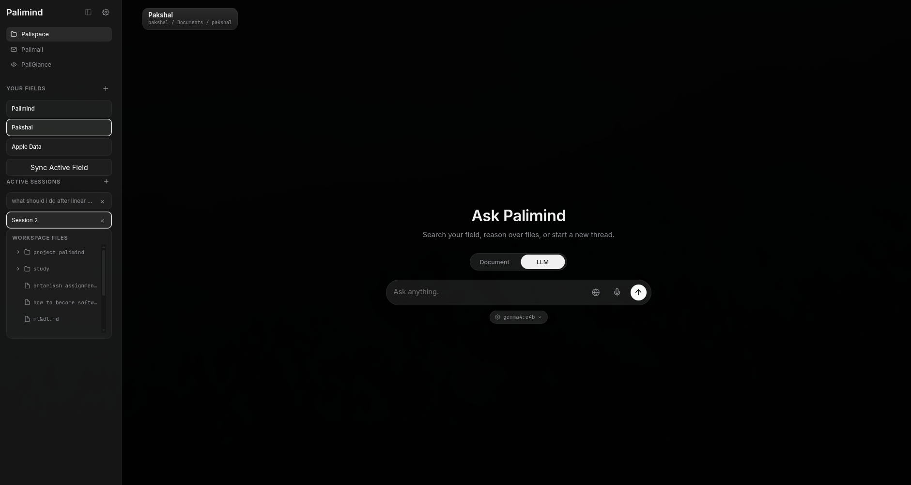
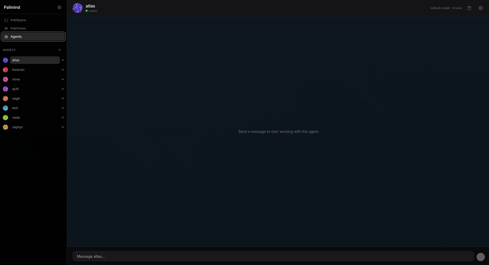

# PaliMind

PaliMind is an open-source, **local-first AI intelligence platform** that brings a full suite of AI productivity tools to your desktop. All inference runs on your own machine via **Ollama** - no cloud subscription, no external API keys required, and no data ever leaves your computer.

It is built on a dual-layer architecture:

- A **Python / FastAPI backend** that handles all AI/ML work (indexing, retrieval, chat, agents, vision, voice).
- A **Tauri 2 desktop shell** (Rust) wrapping a **React + TypeScript + Vite** frontend for native OS integration.

---

## Table of Contents

- [Features](#features)
- [Architecture](#architecture)
- [Prerequisites](#prerequisites)
- [Installation](#installation)
- [Pulling Models](#pulling-models)
- [CLI Usage](#cli-usage)
- [Configuration](#configuration)
- [Tech Stack](#tech-stack)
- [Project Structure](#project-structure)
- [Contributing](#contributing)

---

## Features

### PaliSpace - RAG Workspace

The core retrieval-augmented generation (RAG) engine. Point it at any folder and index every document into a local vector store you can query in natural language.



- **Multimodal indexing** - parses PDF, DOCX, PPTX, XLSX, images (OCR), Markdown, code, CSV, and video (with Whisper transcription).
- **Local vector store** - TurboVec 4-bit quantized embeddings stored in SQLite. No external database.
- **Hierarchical memory** - episodic conversation turns are embedded and retrieved for long-term context.
- **Session management** - multiple persistent chat sessions per workspace with summaries.
- **Web search** - integrated DuckDuckGo search and Scrapling for real-time context augmentation.
- **Knowledge graph** - entities and relationships extracted from documents, queryable and visualized.
- **Summarisation** - per-file summaries, financial fact extraction, and timeline extraction at index time.

### PaliVision / Glance - Screen-Aware AI

Captures your current screen, runs OCR plus an optional vision LLM, and streams a contextual AI response - all locally.


- **OCR extraction** - EasyOCR extracts all visible text from a screenshot.
- **Vision LLM** - optionally calls LLaVA or Moondream for rich visual description.
- **SSE streaming** - response tokens stream in real time.
- **Multi-turn chat** - keeps conversation history across follow-up questions.
- **Session persistence** - each screen conversation is saved to disk.

### PalIAgents - Agent System

A runtime for creating and running specialized agents that can call tools to complete tasks. Agents can be created, run manually, invoked from chat with `@mention` syntax, and scheduled.



Available tools include:

- **Shell execution** (`run_shell`)
- **Python execution** (`run_python`)
- **Web browsing** (`browse_url`)
- **Web search** (DuckDuckGo)
- **arxiv search**
- **RSS feed fetching**
- **CSV query**
- **SQLite query**
- **Knowledge graph query**
- **MQTT** publish/subscribe

Agents maintain their own memory, run history, and chat logs. Tool calls are audited and debug-traced by default.

### Voice I/O

- **Speech-to-text** with Faster-Whisper (`/api/voice/transcribe`)
- **Text-to-speech** with Kokoro-ONNX (`/api/voice/synthesize`)

### OpenCode Integration

PaliMind shares the OpenCode global credential store (`~/.local/share/opencode/auth.json`) so a key configured once is available to both the OpenCode CLI and PaliMind's provider proxy. The desktop launcher checks for authentication and opens an OpenCode login flow if needed.

### Global Hotkeys

Platform-aware global shortcuts registered by the Tauri shell:

| Shortcut | Action |
|---|---|
| `Ctrl/Cmd/Super + Shift + Space` | Toggle the main PaliSpace window |
| `Ctrl/Cmd/Super + Shift + V` | Open PaliGlance (screen capture popup) |

### Customisation

- **Themes** - switch the CLI accent color between teal, purple, amber, blue, and coral.
- **Config** - every retrieval, embedding, and model setting is configurable per workspace in `config.json`.

---

## Architecture

```
Tauri Desktop App
    |  spawns & manages the FastAPI server, registers global hotkeys,
    |  captures the screen, opens WebView windows
    v
FastAPI Server (127.0.0.1:8000)
    |  REST + SSE streaming endpoints
    v
Ollama (127.0.0.1:11434)
    |  chat / embed / vision inference
    v
Local resources: SQLite (FTS5), vector store, filesystem, tools
```

The Tauri shell spawns the Python backend as a child process, polls it until healthy, then loads the React frontend at `http://127.0.0.1:8000/ui` inside a WebView window.

---

## Prerequisites

| Requirement | Version | Notes |
|---|---|---|
| Python | 3.12+ | Backend (packages/backend) |
| Node.js | 18+ | Frontend build + Tauri CLI |
| Rust | stable | Tauri 2 toolchain |
| Ollama | latest | Local LLM inference engine |

---

## Installation

### 1. Install Ollama

```bash
curl -fsSL https://ollama.com/install.sh | sh
```

Windows: download from [ollama.com/download](https://ollama.com/download).

### 2. Clone and set up the Python backend

```bash
git clone <your-repo-url> palimind
cd palimind

# one-shot setup (Linux/macOS):
./scripts/bootstrap.sh

# or manually:
python -m venv .venv
source .venv/bin/activate
# Windows: .venv\Scripts\activate

pip install -e "packages/backend"
# optional hotkey support:
pip install -e "packages/backend[hotkey]"
```

### 3. Install Rust / Tauri prerequisites

Install Rust via [rustup](https://rustup.rs), then on Linux ensure the required system libraries for Tauri are present (see the [Tauri prerequisites](https://v2.tauri.app/start/prerequisites/)).

### 4. Install frontend and desktop dependencies

```bash
npm install                          # root (Tauri CLI)
cd frontend && npm install && cd ..  # React frontend
```

### 5. Build the frontend once

The desktop app loads the prebuilt frontend, so build it before launching:

```bash
cd frontend && npm run build && cd ..
```

### 6. Pull required models

```bash
ollama pull nomic-embed-text
ollama pull gemma4:e2b
ollama pull llava
ollama pull moondream
```

---

## Launching

The one-command launcher installs missing dependencies, starts Ollama, launches the API server, and opens the desktop app:

```bash
pm ui
```

Related flags:

```bash
pm ui --skip-install       # skip dependency install / frontend build
pm ui --keep-backend       # keep Ollama/API server running after the app closes
pm ui --port 8001          # use a custom backend port
```

You can also run the backend directly:

```bash
python -m palimind.api_server --host 127.0.0.1 --port 8000
```

---

## CLI Usage

PaliMind ships a `pm` CLI built with Typer.

### Indexing

```bash
pm init /path/to/project    # initialize a workspace
pm add /path/to/project     # index or update files
```

### Asking questions

```bash
pm ask "What are the key findings in the Q3 report?" --path /path/to/project
```

### Global hotkey listener

```bash
pm hotkey start                        # start listening
pm hotkey start --hotkey alt+shift+c   # custom hotkey
pm hotkey trigger                      # manual capture (for Wayland/Hyprland)
pm hotkey stop                         # stop listening
```

### Configuration

```bash
pm config theme teal        # accent theme: teal, purple, amber, blue, coral
```

---

## Configuration

Per-workspace settings live in `.palimind/config.json` (created in the directory where you run `pm init`). Key defaults:

| Key | Default | Purpose |
|---|---|---|
| `embed_model` | `nomic-embed-text` | Embedding model |
| `chat_model` | `gemma4:e2b` | Chat model |
| `chunk_size` | `3000` | Document chunk size |
| `chunk_overlap` | `500` | Chunk overlap |
| `turbovec_bit_width` | `4` | Embedding compression (2 or 4) |
| `summarise` | `true` | Generate per-file summaries |
| `retrieval_limit` | `10` | Chunks returned per retrieval |
| `context_token_budget` | `8000` | Max tokens in LLM context |
| `rerank` | `true` | Rerank fused results |
| `query_rewrite` | `true` | LLM query rewriting at retrieval |
| `ollama_base_url` | `http://localhost:11434` | Ollama endpoint |
| `extensions` | (many) | Indexed file extensions |

Agent runtime behavior is configurable via environment variables, including:

| Variable | Default | Purpose |
|---|---|---|
| `PALIMIND_ENABLE_PALIAGENTS` | `true` | Master switch for agents |
| `PALIMIND_SHELL_EXEC_TIMEOUT` | `30` | Shell tool timeout (s) |
| `PALIMIND_PYTHON_EXEC_TIMEOUT` | `30` | Python tool timeout (s) |
| `PALIMIND_PYTHON_EXEC_MEMORY_MB` | `512` | Python tool memory cap |
| `PALIMIND_ALLOWED_PATHS` | (empty) | Extra paths file tools may access |
| `PALIMIND_AGENT_SCHEDULER_TICK` | `15` | Scheduler poll interval (s) |

---

## Tech Stack

| Layer | Technology |
|---|---|
| Desktop shell | Tauri 2 (Rust), Tauri global shortcut plugin, xcap screen capture |
| Frontend | React, TypeScript, Vite |
| Backend | Python 3.12+, FastAPI, Uvicorn |
| CLI | Typer, Rich |
| AI / Inference | Ollama (Gemma, LLaVA, Moondream, nomic-embed-text) |
| Embeddings | Sentence-Transformers, TurboVec (4-bit quantized) |
| STT / TTS | Faster-Whisper, Kokoro-ONNX |
| OCR | EasyOCR |
| Database | SQLite with FTS5 |
| Encryption | Fernet (AES-128, cryptography) |

---

## Project Structure

```
.
├── apps/desktop/src-tauri/  # Tauri 2 Rust shell (backend spawn, hotkeys, tray)
├── packages/
│   ├── backend/             # Python package "palimind"
│   │   ├── palimind/
│   │   │   ├── agents/      # PalIAgents runtime, registry, scheduler
│   │   │   │   └── tools/   # in-app agent tools (shell, python, web, sqlite, ...)
│   │   │   ├── cli/         # Typer CLI (commands, UI)
│   │   │   ├── document/    # document engine, graph, stream
│   │   │   ├── generative/  # summariser, responder
│   │   │   ├── hwfit/       # hardware fitting / recommendations
│   │   │   ├── ingestion/   # chunkers, parsers, OCR, crawler, video
│   │   │   ├── llm/         # streaming + mixture-of-expert orchestration
│   │   │   ├── storage/     # vector store, metadata, chat store
│   │   │   ├── api_server.py# FastAPI application
│   │   │   └── ...
│   │   ├── pyproject.toml   # Python package + CLI entry point
│   │   └── tests/           # Python tests
│   └── frontend/            # React + TypeScript + Vite UI (incl. glance app)
├── skills/                  # developer skills (SKILL.md) for AI coding agents
├── brand/                   # icons, fonts, design tokens
├── docs/                    # onboarding, architecture, contributing
├── docker/                  # backend image + compose (dev/server use)
├── scripts/                 # dev.sh / bootstrap.sh / generate-icons.sh / helpers
└── Makefile                 # make dev · build · test · lint · fmt · icons
```

---

## Contributing

See `CONTRIBUTING.md` and the developer skills in `/skills`. Quick version:

1. Fork the repository.
2. Create a feature branch: `git checkout -b feat/your-feature`.
3. Run the gates: `make lint && make test`.
4. Commit with conventional commits (`feat: add feature`) and open a PR.

Note: Core backend changes should degrade gracefully when Ollama is not running.

---

PaliMind is an open-source project. Contributions are welcome.
