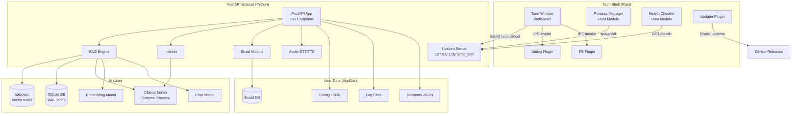
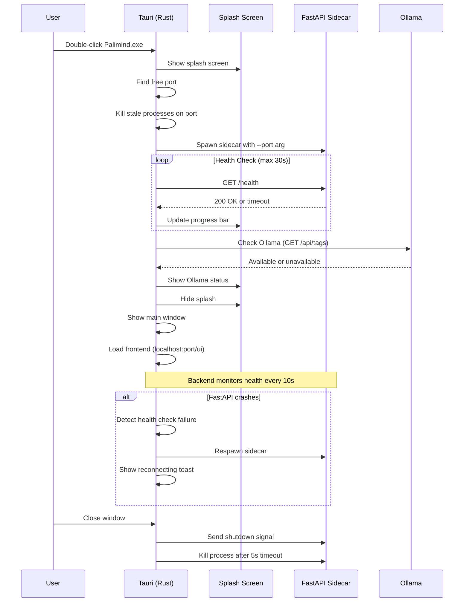
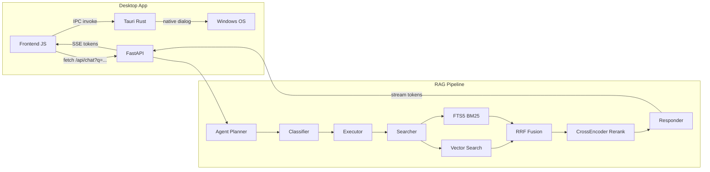

# Part 2: Architecture & Diagrams

## Task 1 — Architecture Audit

### Current System Map

| Layer | Technology | Files | Notes |
|-------|-----------|-------|-------|
| **Frontend** | Vanilla HTML/CSS/JS | `ui/static/app.js` (68KB), `styles.css` (49KB), `index.html` (28KB) | Single-page app, SSE streaming |
| **API Server** | FastAPI + Uvicorn | `core/api_server.py` (1039 lines) | 25+ endpoints, SSE events, file picker via tkinter subprocess |
| **RAG Pipeline** | Agent Planner → Retrieval → Responder | `core/agent_planner/`, `core/retrieval/`, `core/querying.py` | Hybrid BM25+vector, CrossEncoder reranking |
| **Vector Store** | turbovec IdMapIndex | `core/storage/vector_store.py` | Compressed 4-bit vectors, disk-persistent |
| **Database** | SQLite (WAL mode) | `core/storage/db.py` (660 lines) | FTS5, financial facts, timeline events |
| **Embeddings** | Ollama API (`nomic-embed-text`) | `core/retrieval/embedder.py` | HTTP calls to Ollama |
| **LLM** | Ollama API (streaming) | `core/generative/responder.py` | httpx streaming client |
| **Email** | IMAP/SMTP + SQLite | `core/email/` (23 files) | Fernet encryption, Phase 1+2 |
| **Audio** | faster-whisper, kokoro-onnx | `core/audio_stt.py`, `core/audio_tts.py` | STT/TTS |
| **Hardware** | psutil/GPUtil detection | `core/hwfit/` | Model recommendations |
| **Config** | JSON files | `core/config.py` | Per-workspace + global config |

### Risks & Bottlenecks

| Risk | Severity | Mitigation |
|------|----------|------------|
| **PyInstaller + sentence-transformers** | HIGH | Use `onedir` mode; externalize large models |
| **tkinter folder picker** | HIGH | Replace with Tauri dialog plugin IPC |
| **Installer size (~1GB+)** | MEDIUM | Lazy model download on first run |
| **Port conflicts on restart** | MEDIUM | Kill stale processes before spawn; dynamic port |
| **SQLite file locking** | LOW | WAL mode already enabled; single-writer pattern OK |
| **Ollama dependency** | MEDIUM | Health check with graceful degradation messaging |
| **faster-whisper/kokoro-onnx bundling** | MEDIUM | These pull ONNX runtime; add to PyInstaller hooks |

### Packaging Challenges

1. **turbovec** — native C extension; must be compiled for target platform
2. **sentence-transformers** — pulls PyTorch; consider using ONNX-only CrossEncoder
3. **numpy** — large binary; PyInstaller handles it but adds ~50MB
4. **cryptography** — requires OpenSSL bindings; PyInstaller hook exists

---

## Task 2 — Target Architecture

### Architecture Diagram



### Startup Sequence Diagram



### Data Flow Diagram



---

## Task 5 — Project Structure

```
palimind/
├── src-tauri/                          # Tauri Rust project
│   ├── Cargo.toml                      # Rust dependencies
│   ├── tauri.conf.json                 # Tauri config (window, bundle, plugins)
│   ├── build.rs                        # Build script
│   ├── capabilities/
│   │   └── default.json                # IPC permissions (dialog, shell, fs)
│   ├── icons/                          # App icons (all sizes)
│   ├── binaries/                       # PyInstaller sidecar output goes here
│   │   └── palimind-server-x86_64-pc-windows-msvc.exe
│   └── src/
│       ├── lib.rs                      # Tauri app builder, commands
│       ├── main.rs                     # Entry point
│       ├── sidecar.rs                  # FastAPI process management
│       ├── health.rs                   # Health check polling
│       └── tray.rs                     # System tray (optional)
│
├── frontend/                           # Web UI (existing, moved from ui/)
│   ├── static/
│   │   ├── app.js                      # Main application JS
│   │   ├── styles.css                  # Styles
│   │   ├── hotkey.js                   # Hotkey UI
│   │   └── hotkey.css
│   └── template/
│       ├── index.html                  # Main HTML
│       └── hotkey.html
│
├── backend/                            # Python backend (existing core/)
│   ├── core/                           # Existing core module (unchanged)
│   │   ├── api_server.py               # FastAPI app
│   │   ├── config.py                   # Configuration
│   │   ├── agent.py                    # Query agent
│   │   ├── agent_planner/              # Agentic RAG planner
│   │   ├── retrieval/                  # Search pipeline
│   │   ├── ingestion/                  # Document processing
│   │   ├── generative/                 # LLM response generation
│   │   ├── storage/                    # SQLite + turbovec
│   │   ├── email/                      # Email module
│   │   ├── diagnostics/                # RAG diagnostics
│   │   ├── hwfit/                      # Hardware detection
│   │   ├── tools/                      # Comparison, timeline, etc.
│   │   ├── prompts/                    # System prompts
│   │   └── cli/                        # CLI (kept for dev/power users)
│   ├── hotkey/                         # Hotkey module
│   ├── server_entry.py                 # NEW: PyInstaller entry point
│   ├── palimind.spec                   # NEW: PyInstaller spec file
│   ├── pyproject.toml                  # Existing (moved)
│   └── requirements-build.txt          # Pinned deps for PyInstaller
│
├── config/                             # Build & release config
│   ├── pyinstaller/
│   │   └── hooks/                      # Custom PyInstaller hooks
│   └── nsis/
│       └── installer.nsi              # Custom NSIS script (if needed)
│
├── scripts/                            # Build automation
│   ├── build-sidecar.ps1               # Build PyInstaller binary
│   ├── build-release.ps1               # Full release build
│   └── dev.ps1                         # Development launcher
│
├── .github/
│   └── workflows/
│       ├── ci.yml                      # Lint + test on PR
│       └── release.yml                 # Build + sign + publish
│
├── tests/                              # Existing tests
├── README.md
└── .gitignore
```

### Folder Explanations

| Folder | Purpose |
|--------|---------|
| `src-tauri/` | Rust shell: window management, sidecar lifecycle, IPC commands, system tray, auto-updater |
| `src-tauri/binaries/` | Pre-built PyInstaller sidecar binary (gitignored; built by CI or locally) |
| `src-tauri/capabilities/` | Tauri v2 permission files granting frontend access to dialog, shell, fs plugins |
| `frontend/` | Existing UI files moved from `ui/`. Served by FastAPI at `/ui` |
| `backend/` | All Python code. `core/` stays untouched except the folder picker endpoint |
| `backend/server_entry.py` | Thin wrapper: parses `--port` arg, calls `uvicorn.run()` — the PyInstaller entry point |
| `config/` | Build tooling config (PyInstaller hooks, NSIS customization) |
| `scripts/` | PowerShell scripts for building sidecar, full release, and dev mode |
| `.github/workflows/` | CI/CD: test on PR, build+sign+release on tag push |

### Runtime Data Locations (AppData)

```
%LOCALAPPDATA%\Palimind\
├── config/
│   └── global_config.json          # Active field, model selection
├── data/
│   ├── email.db                    # Email database (existing ~/.palimind/)
│   └── agents.json                 # Custom agent definitions
├── logs/
│   ├── palimind-server.log         # FastAPI stdout/stderr
│   └── tauri.log                   # Rust-side logs
├── cache/
│   └── models/                     # Downloaded ML models (reranker, etc.)
└── temp/                           # Transient files
```

> [!NOTE]
> Per-workspace data (`.palimind/` folders with `index.db`, `config.json`, `sessions.json`, `turbovec.*`) stays in each workspace directory — unchanged from current behavior.
