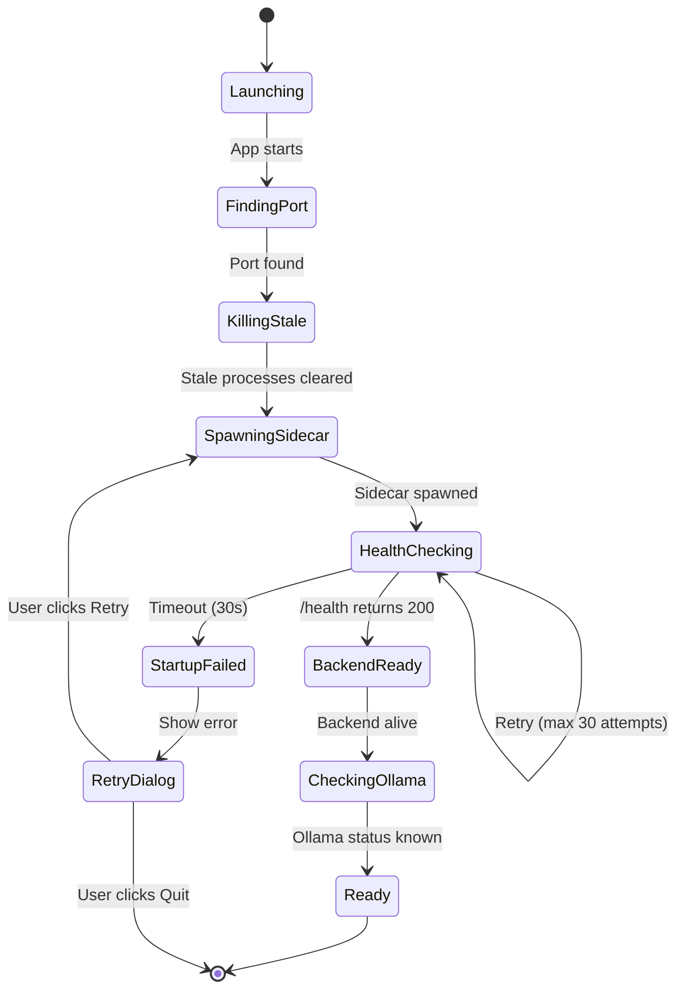
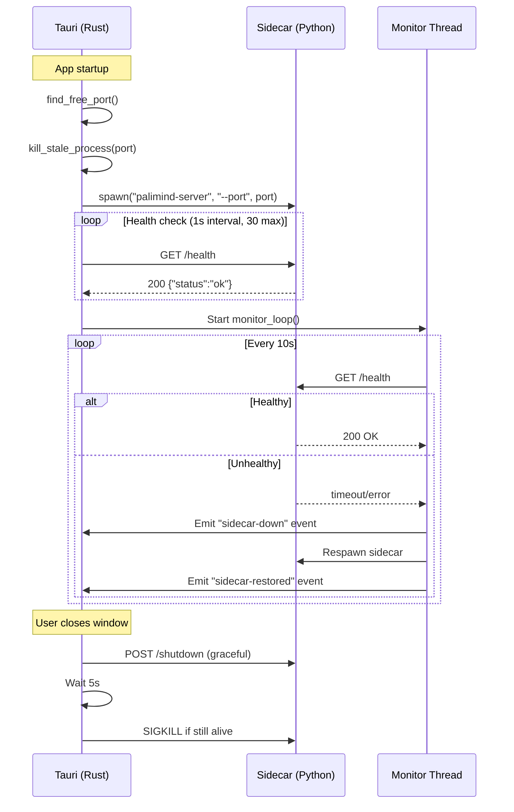

# Part 3: Startup, FastAPI Integration, Data & UX

---

## Task 3 — Application Startup Flow

### Startup State Machine



### Splash Screen States

| State | Progress | Message | Duration |
|-------|----------|---------|----------|
| `LAUNCHING` | 0% | "Starting Palimind..." | ~100ms |
| `FINDING_PORT` | 10% | "Configuring network..." | ~50ms |
| `KILLING_STALE` | 15% | "Cleaning up..." | ~200ms |
| `SPAWNING_SIDECAR` | 25% | "Starting AI engine..." | ~2s |
| `HEALTH_CHECKING` | 25→70% | "Initializing backend..." | 3–15s |
| `CHECKING_OLLAMA` | 80% | "Connecting to Ollama..." | ~1s |
| `LOADING_UI` | 90% | "Loading interface..." | ~500ms |
| `READY` | 100% | "Ready" | ~200ms fade |

### Error Handling & Recovery

| Failure | Detection | Recovery |
|---------|-----------|----------|
| Port in use | `bind()` fails | Try next port in range 8000–8099 |
| Sidecar won't start | Process exits immediately | Show error log + Retry button |
| Health check timeout | 30s with no 200 | Kill process, retry once, then show dialog |
| Ollama unavailable | `/api/tags` fails | Show warning banner; app still loads (degraded) |
| Crash during use | Health poll fails | Auto-restart sidecar, show "Reconnecting..." toast |

### Rust Implementation Approach (`sidecar.rs`)

```rust
// Pseudocode for sidecar management
pub struct SidecarManager {
    child: Option<CommandChild>,
    port: u16,
    health_url: String,
    max_restarts: u32,
    restart_count: u32,
}

impl SidecarManager {
    /// Find a free port in range 8000-8099
    fn find_free_port() -> u16;
    
    /// Kill any process already listening on the target port
    fn kill_stale_process(port: u16) -> Result<()>;
    
    /// Spawn the PyInstaller sidecar with --port argument
    fn spawn(&mut self, app: &AppHandle) -> Result<()> {
        // app.shell().sidecar("palimind-server")
        //   .args(["--port", &self.port.to_string()])
        //   .env("PYTHONUTF8", "1")
        //   .spawn()
    }
    
    /// Poll GET /health every 1s, max 30 attempts
    async fn wait_for_healthy(&self) -> Result<()>;
    
    /// Background task: poll health every 10s, restart if dead
    async fn monitor_loop(&mut self, app: AppHandle);
    
    /// Graceful shutdown: POST /shutdown, then kill after 5s
    async fn shutdown(&mut self) -> Result<()>;
}
```

---

## Task 4 — FastAPI Integration

### Changes to `api_server.py`

Only **2 changes** needed to existing backend code:

#### 1. Add `/health` endpoint

```python
@app.get("/health")
async def health_check():
    return {"status": "ok", "version": "2.0.0", "pid": os.getpid()}
```

#### 2. Replace folder picker with Tauri IPC

The current `_select_dir_blocking()` uses tkinter subprocess. In desktop mode, the frontend calls Tauri's `dialog.open()` instead:

```javascript
// Frontend: replace fetch('/api/fields/select_dialog') with:
import { open } from '@tauri-apps/plugin-dialog';
const selected = await open({ directory: true, title: 'Select Field' });
if (selected) {
    await fetch('/api/fields/add', {
        method: 'POST',
        body: JSON.stringify({ path: selected })
    });
}
```

The `/api/fields/select_dialog` endpoint remains for backward compatibility but is no longer the primary path.

### New: `server_entry.py` (PyInstaller Entry Point)

```python
"""PyInstaller entry point for Palimind sidecar server."""
import argparse
import multiprocessing
import os
import sys
import logging

def main():
    multiprocessing.freeze_support()  # Required for PyInstaller on Windows
    
    parser = argparse.ArgumentParser()
    parser.add_argument('--port', type=int, default=8000)
    parser.add_argument('--log-file', type=str, default=None)
    args = parser.parse_args()
    
    # Configure logging
    if args.log_file:
        logging.basicConfig(filename=args.log_file, level=logging.INFO)
    
    # Import and run
    from core.api_server import app
    import uvicorn
    uvicorn.run(app, host="127.0.0.1", port=args.port, log_level="info")

if __name__ == "__main__":
    main()
```

### Process Lifecycle



### Crash Recovery Rules

| Scenario | Behavior |
|----------|----------|
| Sidecar exits cleanly (code 0) | Don't restart — intentional shutdown |
| Sidecar crashes (code ≠ 0) | Auto-restart up to 3 times in 60s |
| Restart loop detected | Show error dialog, offer manual restart |
| Port conflict after restart | Kill conflicting process, then respawn |

---

## Task 6 — Local Data Management

### Storage Layout

| Data Type | Location | Format | Survives Update? |
|-----------|----------|--------|-----------------|
| **Workspace indexes** | `<workspace>/.palimind/` | SQLite + turbovec binary | ✅ Yes (user dirs) |
| **Workspace config** | `<workspace>/.palimind/config.json` | JSON | ✅ Yes |
| **Sessions/chat history** | `<workspace>/.palimind/sessions.json` | JSON | ✅ Yes |
| **Global config** | `%LOCALAPPDATA%\Palimind\config\` | JSON | ✅ Yes |
| **Email database** | `%LOCALAPPDATA%\Palimind\data\email.db` | SQLite | ✅ Yes |
| **Agent definitions** | `%LOCALAPPDATA%\Palimind\data\agents.json` | JSON | ✅ Yes |
| **Server logs** | `%LOCALAPPDATA%\Palimind\logs\` | Text | ✅ Rotated |
| **Model cache** | `%LOCALAPPDATA%\Palimind\cache\models\` | Binary | ✅ Yes |
| **App binaries** | `%LOCALAPPDATA%\Programs\Palimind\` | EXE/DLL | ❌ Replaced |

### Why Updates Preserve User Data

NSIS installs binaries to `%LOCALAPPDATA%\Programs\Palimind\`. User data lives in `%LOCALAPPDATA%\Palimind\`. These are **separate directories**. The updater replaces only the Programs folder. User data is never touched.

### Backup Strategy

```
Backup trigger: Manual (Settings → Export Data) + before auto-update

Backup contents:
  - global_config.json
  - agents.json
  - email.db (if < 500MB)

Backup format: palimind-backup-YYYYMMDD.zip
Backup location: User-chosen via Save dialog

Recovery: Settings → Import Backup → select .zip
```

### Log Rotation

- Max file size: 10MB per log file
- Keep last 5 rotated files
- Server logs: `palimind-server.log`, `palimind-server.log.1`, etc.
- Tauri logs: `tauri.log` (via `tauri-plugin-log`)

---

## Task 7 — Desktop UX Design

> All improvements are **UI/UX only**. Zero changes to business logic.

### Splash Screen

Inspired by **Cursor** and **LM Studio** startup:

- Dark background (#0a0a0f) with subtle gradient
- Centered Palimind logo with gentle pulse animation
- Progress bar (thin, accent-colored)
- Status text below bar showing current stage
- "Starting AI engine..." → "Initializing backend..." → "Ready"
- Fade-out transition to main window (300ms)

### Loading & Empty States

| State | Current | Improved |
|-------|---------|----------|
| **No field selected** | Blank screen | Hero illustration + "Select a workspace to begin" CTA |
| **Indexing in progress** | Status text | Animated progress ring + file count + ETA |
| **Ollama offline** | Error text | Yellow banner: "AI features unavailable — start Ollama to enable" |
| **Empty chat** | Blank chat area | Suggested prompts: "Summarize all documents", "Compare files", etc. |

### Chat Interface Improvements

Reference: **ChatGPT Desktop** / **Claude Desktop** patterns

- **Streaming indicators**: Animated cursor (▊) during token streaming
- **Source citations**: Collapsible chips below response, click to expand context
- **Copy button**: Appears on hover over any response block
- **Regenerate**: Button below each response
- **Session sidebar**: Collapsible panel with session list, search, rename, delete

### File Upload UX

- **Drag & drop zone**: Dashed border area in chat, appears on drag-over
- **Upload progress**: Per-file progress bars with cancel buttons
- **File type icons**: Different icons for PDF, PPTX, code, image
- **Indexing toast**: "3 files indexed successfully" notification

### Settings Page

Tabbed settings panel (accessible via ⚙️ in sidebar):

| Tab | Contents |
|-----|----------|
| **General** | Theme (dark/light), language, startup behavior |
| **AI Models** | Model selector (existing Cookbook), Ollama URL, embed model |
| **Storage** | Workspace list, data usage, clear cache, export/import |
| **About** | Version, update check, licenses, system info |

### Notifications

- **Toast notifications** (bottom-right, auto-dismiss 5s):
  - Index complete, model switched, update available
- **Banner notifications** (top, persistent until dismissed):
  - Ollama offline, update ready to install
- **System tray** (optional): Minimize to tray, notification badge

### Error Handling Screens

- **Backend crashed**: Full-screen overlay with spinner + "Reconnecting to AI engine..."
- **Unrecoverable error**: Error details + "Restart" button + "Copy logs" button
- **Network error**: Inline error with retry button (not full-screen)
