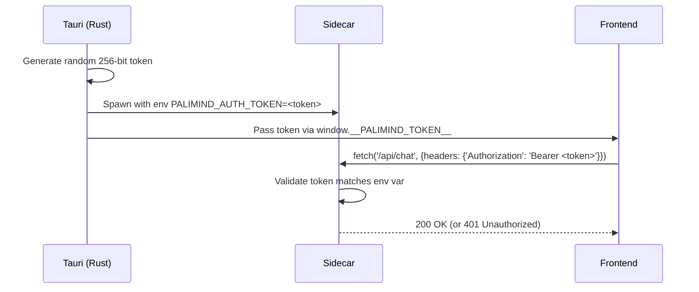
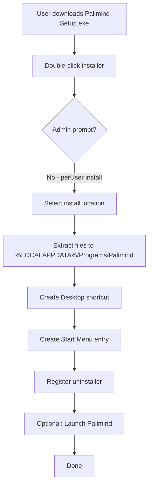
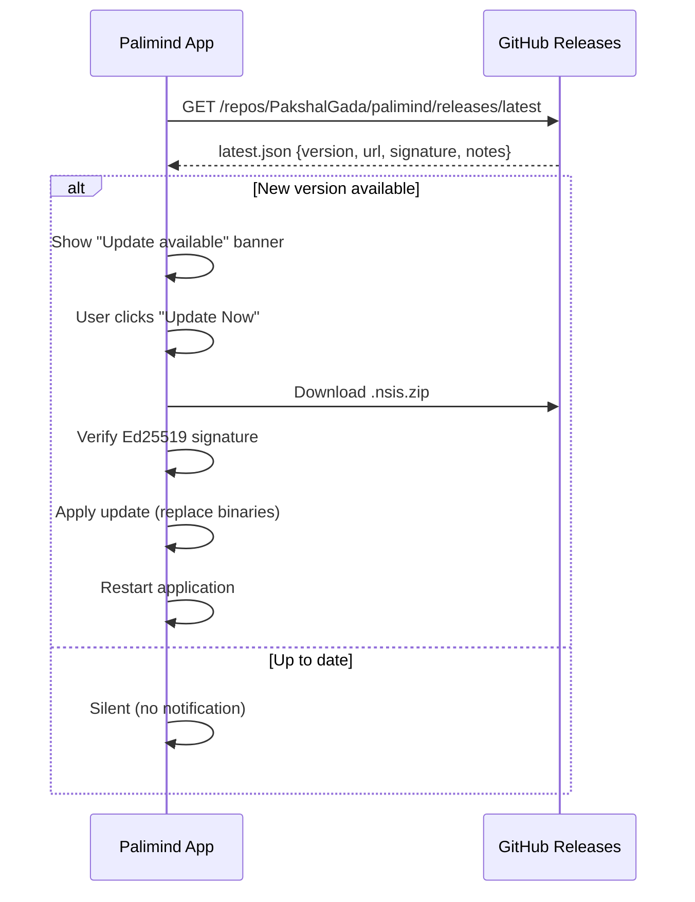
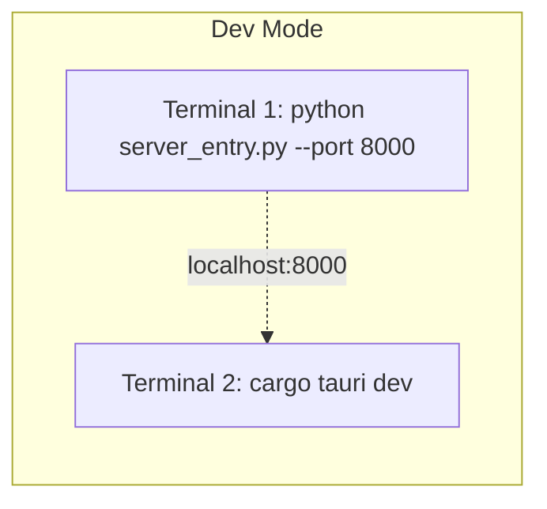
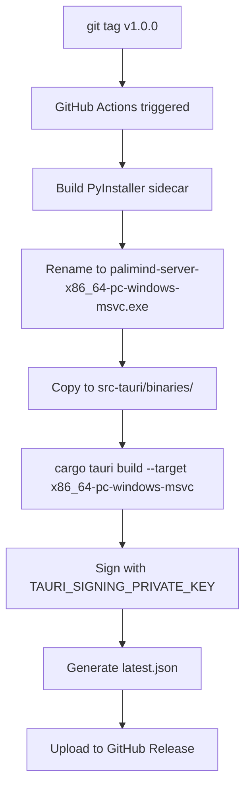

# Part 4: Security, Performance, Installer, CI/CD & Roadmap

---

## Task 8 — Security Review

### Threat Model

| Threat | Vector | Current Status | Mitigation |
|--------|--------|---------------|------------|
| **Localhost API exposure** | Another app on same machine calls `localhost:8000` | CORS allows `*` | Bind to `127.0.0.1` only (already done); add secret header token per session |
| **Tauri IPC abuse** | Malicious JS in webview | No restriction | Capabilities lock down to only needed plugins; CSP headers |
| **File system traversal** | `/api/fs/list` accepts arbitrary path | Returns any directory contents | Tauri fs-plugin scopes restrict accessible directories |
| **Prompt injection** | User submits adversarial queries | No input sanitization | System prompts have guardrails; RAG context is read-only |
| **RAG ingestion attacks** | Malicious PDF/DOCX with embedded scripts | pymupdf/python-pptx parse content only | Sandbox parsing; limit file sizes; validate extensions |
| **Email credential theft** | Read `email.db` file directly | Fernet AES encryption (machine-bound) | Keep current approach; add file permission restrictions |
| **Model execution** | Ollama runs arbitrary models | User controls model selection | No mitigation needed — intentional feature |
| **Local storage tampering** | Modify `sessions.json` / `config.json` | No integrity checks | Low risk for local-only app; add optional HMAC signing |
| **Update MITM** | Intercept update download | Unsigned updates | Tauri updater uses Ed25519 signatures — mandatory |
| **DLL hijacking** | Place malicious DLL in app directory | Standard Windows risk | Sign all binaries; use `SetDllDirectory("")` |

### Security Checklist

- [ ] Bind FastAPI to `127.0.0.1` only (✅ already done)
- [ ] Generate per-session auth token passed via environment variable to sidecar
- [ ] Add `Authorization: Bearer <token>` header validation to FastAPI middleware
- [ ] Configure Tauri CSP: `default-src 'self'; connect-src http://127.0.0.1:*`
- [ ] Lock Tauri capabilities to minimum: `dialog:allow-open`, `shell:allow-execute`
- [ ] Disable Tauri devtools in production builds
- [ ] Sign Windows installer and executable with code signing certificate
- [ ] Sign updates with Ed25519 keypair via `tauri signer generate`
- [ ] Set file permissions on `email.db` (read/write only by current user)
- [ ] Validate file extensions before ingestion (reject `.exe`, `.bat`, `.ps1`)
- [ ] Limit upload file size (configurable, default 100MB per file)
- [ ] Rate-limit API endpoints (optional; low priority for local-only app)

### Session Token Flow



---

## Task 9 — Performance Optimization

### Startup Speed

| Optimization | Impact | Effort |
|-------------|--------|--------|
| Use PyInstaller `onedir` mode (not `onefile`) | Eliminates 10–30s extraction on cold start | LOW |
| Lazy-load `sentence-transformers` (only when first query) | -3s from startup | LOW |
| Lazy-load `faster-whisper` and `kokoro-onnx` | -2s from startup | LOW |
| Pre-warm Ollama connection in background thread | -1s from first query | LOW |
| Use `--port` argument (no config file read at boot) | -100ms | TRIVIAL |

**Expected gain: Startup from 15–20s → 4–6s**

### Model Loading

| Optimization | Impact | Effort |
|-------------|--------|--------|
| Cache CrossEncoder model to disk (`%LOCALAPPDATA%\Palimind\cache\`) | Avoid re-download on every launch | LOW |
| Load reranker in background thread after first query | UI never blocks on model init | MEDIUM |
| Consider ONNX-exported CrossEncoder (smaller, faster) | -50% model load time | MEDIUM |

### Vector Search

| Optimization | Impact | Effort |
|-------------|--------|--------|
| turbovec `_global_search_cache` (✅ already implemented) | O(1) repeated searches | DONE |
| Increase `IdMapIndex` search batch size for large indexes | Better CPU utilization | LOW |
| Pre-load vector index at startup (background thread) | First search is instant | LOW |

### Memory Usage

| Optimization | Impact | Effort |
|-------------|--------|--------|
| Limit chat history to last 5 messages in context (✅ already done) | Bounded memory | DONE |
| Garbage-collect embedding cache (`lru_cache(128)`) periodically | -50MB over long sessions | LOW |
| Stream SSE responses (✅ already done — no buffering) | Constant memory during response | DONE |

### Frontend Rendering

| Optimization | Impact | Effort |
|-------------|--------|--------|
| Use `requestAnimationFrame` for token append during streaming | Smoother rendering, fewer reflows | LOW |
| Virtualize session list for users with 100+ sessions | Eliminates DOM bloat | MEDIUM |
| Debounce file tree rendering during indexing events | Reduce unnecessary repaints | LOW |

### Summary of Expected Gains

| Metric | Current | After Optimization |
|--------|---------|-------------------|
| Cold startup | 15–20s | 4–6s |
| First query | 5–8s | 3–5s |
| Memory (idle) | ~400MB | ~250MB |
| Memory (peak) | ~1.2GB | ~800MB |

---

## Task 10 — Installer Design

### Installer Technology: **NSIS** (via Tauri)

NSIS is recommended over WiX for auto-update compatibility and per-user installation.

### Installation Flow



### `tauri.conf.json` Bundle Config

```json
{
  "bundle": {
    "active": true,
    "targets": ["nsis"],
    "icon": ["icons/32x32.png", "icons/128x128.png", "icons/icon.ico"],
    "externalBin": ["binaries/palimind-server"],
    "windows": {
      "nsis": {
        "installMode": "currentUser",
        "displayLanguageSelector": false,
        "startMenuFolder": "Palimind",
        "headerImage": "icons/nsis-header.bmp",
        "sidebarImage": "icons/nsis-sidebar.bmp"
      }
    }
  }
}
```

### What the Installer Includes

| Component | Size (est.) | Location After Install |
|-----------|-------------|----------------------|
| Tauri shell + WebView2 loader | ~5MB | `Programs/Palimind/` |
| Frontend assets (HTML/CSS/JS) | ~200KB | Embedded in Tauri binary |
| PyInstaller sidecar (`palimind-server.exe` + deps) | ~200MB–1GB | `Programs/Palimind/binaries/` |
| Icons and splash assets | ~1MB | `Programs/Palimind/` |

### Uninstall Behavior

- Remove all files from `%LOCALAPPDATA%\Programs\Palimind\`
- Remove Start Menu and Desktop shortcuts
- **Do NOT remove** `%LOCALAPPDATA%\Palimind\` (user data)
- Offer optional "Remove all data" checkbox in uninstaller

---

## Task 11 — Auto-Update System

### Versioning: Semantic Versioning

`MAJOR.MINOR.PATCH` (e.g., `1.0.0`, `1.1.0`, `1.1.3`)

- **MAJOR**: Breaking changes (data format, config schema)
- **MINOR**: New features, new endpoints
- **PATCH**: Bug fixes, performance improvements

### Update Architecture



### Tauri Updater Plugin Config

```json
{
  "plugins": {
    "updater": {
      "active": true,
      "endpoints": [
        "https://github.com/PakshalGada/palimind/releases/latest/download/latest.json"
      ],
      "dialog": true,
      "pubkey": "dW50cnVzdGVkIGNvbW1lbnQ...",
      "windows": {
        "installMode": "passive"
      }
    }
  }
}
```

### Update Modes

| Mode | Behavior | Config |
|------|----------|--------|
| `passive` | Download + install silently, restart prompt | Default |
| `basicUi` | Show progress dialog during install | Alternative |
| `quiet` | Fully silent, no UI at all | Not recommended |

### Rollback Strategy

- Keep previous version's sidecar binary as `palimind-server.prev.exe`
- If new sidecar fails health check 3 times post-update, swap back to `.prev`
- Tauri shell itself is managed by NSIS — rollback requires reinstall of prev version

---

## Task 12 — Build & Release Pipeline

### Development Workflow



In dev mode, the Tauri frontend connects to a manually-started Python process. No PyInstaller build needed during development.

`scripts/dev.ps1`:
```powershell
# Start FastAPI in background
Start-Process -NoNewWindow python -ArgumentList "backend/server_entry.py","--port","8000"
# Start Tauri dev (hot reload)
Set-Location src-tauri
cargo tauri dev
```

### Production Build



### GitHub Actions Workflow (`.github/workflows/release.yml`)

```yaml
name: Release
on:
  push:
    tags: ['v*']

jobs:
  build-windows:
    runs-on: windows-latest
    steps:
      - uses: actions/checkout@v4
      
      - name: Setup Python
        uses: actions/setup-python@v5
        with:
          python-version: '3.11'
      
      - name: Setup Rust
        uses: dtolnay/rust-toolchain@stable
      
      - name: Setup Node (for Tauri CLI)
        uses: actions/setup-node@v4
        with:
          node-version: '20'
      
      - name: Install Python deps
        run: |
          pip install -r backend/requirements-build.txt
          pip install pyinstaller
      
      - name: Build sidecar
        run: |
          cd backend
          pyinstaller palimind.spec
          $triple = "x86_64-pc-windows-msvc"
          Copy-Item "dist/palimind-server/palimind-server.exe" `
            "../src-tauri/binaries/palimind-server-$triple.exe"
      
      - name: Install Tauri CLI
        run: npm install -g @tauri-apps/cli@next
      
      - name: Build Tauri
        env:
          TAURI_SIGNING_PRIVATE_KEY: ${{ secrets.TAURI_PRIVATE_KEY }}
          TAURI_SIGNING_PRIVATE_KEY_PASSWORD: ${{ secrets.TAURI_KEY_PASSWORD }}
        run: cargo tauri build
      
      - name: Upload Release
        uses: softprops/action-gh-release@v2
        with:
          files: |
            src-tauri/target/release/bundle/nsis/*.exe
            src-tauri/target/release/bundle/nsis/*.sig
            src-tauri/target/release/bundle/nsis/latest.json
```

---

## Task 13 — Migration Roadmap

### Phase 1: Architecture Preparation (Week 1–2)

| Task | Effort | Risk | Deliverable |
|------|--------|------|-------------|
| Restructure folders (move `ui/` → `frontend/`, `core/` into `backend/`) | 2h | LOW | Clean project layout |
| Create `server_entry.py` PyInstaller entry point | 1h | LOW | Bootable sidecar entry |
| Add `/health` endpoint to `api_server.py` | 15min | LOW | Health check endpoint |
| Add auth token middleware to FastAPI | 2h | LOW | Secured localhost API |
| Create `palimind.spec` PyInstaller spec file | 4h | MEDIUM | Working sidecar build |
| Test PyInstaller build with all dependencies | 8h | HIGH | Validated `onedir` build |
| Move global config paths to `%LOCALAPPDATA%\Palimind\` | 2h | LOW | Correct data locations |

**Risk**: PyInstaller + sentence-transformers + turbovec may need custom hooks. Budget extra time.

### Phase 2: Tauri Integration (Week 2–3)

| Task | Effort | Risk | Deliverable |
|------|--------|------|-------------|
| Initialize Tauri v2 project (`cargo tauri init`) | 1h | LOW | `src-tauri/` scaffold |
| Configure `tauri.conf.json` (window, bundle, plugins) | 2h | LOW | Working config |
| Set up capabilities for dialog, shell, fs plugins | 2h | LOW | IPC permissions |
| Implement `sidecar.rs` (spawn, port finding, env vars) | 8h | MEDIUM | Process management |
| Implement `health.rs` (polling, restart logic) | 4h | MEDIUM | Health monitoring |
| Wire frontend to use dynamic port from Tauri | 2h | LOW | Port-aware frontend |
| Replace tkinter folder picker with Tauri dialog IPC | 3h | LOW | Native dialog |
| Test: Tauri launches sidecar, frontend loads | 4h | MEDIUM | End-to-end smoke test |

### Phase 3: Backend Process Management (Week 3–4)

| Task | Effort | Risk | Deliverable |
|------|--------|------|-------------|
| Implement crash detection and auto-restart | 4h | MEDIUM | Resilient sidecar |
| Implement graceful shutdown on window close | 2h | LOW | Clean process cleanup |
| Add server logging to file (log rotation) | 2h | LOW | Persistent logs |
| Test: crash recovery, port conflicts, stale processes | 8h | MEDIUM | Reliability validated |
| Add "Reconnecting..." UI overlay for sidecar restarts | 3h | LOW | User feedback during recovery |

### Phase 4: Desktop UX (Week 4–5)

| Task | Effort | Risk | Deliverable |
|------|--------|------|-------------|
| Create splash screen (HTML/CSS in Tauri splashscreen window) | 4h | LOW | Premium startup |
| Implement startup progress indicators | 2h | LOW | User feedback |
| Add empty states and Ollama status banner | 3h | LOW | Guided onboarding |
| Improve streaming indicators (animated cursor) | 1h | LOW | ChatGPT-like UX |
| Add Settings page (tabs: General, AI, Storage, About) | 8h | LOW | Configuration UI |
| Add toast notification system | 3h | LOW | Event feedback |
| Error recovery screens | 4h | LOW | Graceful error handling |

### Phase 5: Packaging (Week 5–6)

| Task | Effort | Risk | Deliverable |
|------|--------|------|-------------|
| Build final PyInstaller sidecar (optimize size) | 4h | MEDIUM | Production sidecar |
| Configure NSIS installer (icons, shortcuts, uninstall) | 4h | LOW | Windows installer |
| Test full install → run → uninstall cycle | 4h | MEDIUM | Validated installer |
| App icon design (all required sizes) | 2h | LOW | Professional branding |
| Test on clean Windows machine (no Python installed) | 4h | HIGH | Real-world validation |

### Phase 6: Updates (Week 6–7)

| Task | Effort | Risk | Deliverable |
|------|--------|------|-------------|
| Generate Ed25519 signing keypair | 30min | LOW | Signing keys |
| Configure `tauri-plugin-updater` | 2h | LOW | Update system |
| Set up GitHub Actions release workflow | 4h | MEDIUM | Automated releases |
| Test update flow (v1.0.0 → v1.0.1) | 4h | MEDIUM | Validated updates |
| Implement rollback for failed sidecar updates | 4h | MEDIUM | Update safety net |

### Phase 7: Production Hardening (Week 7–8)

| Task | Effort | Risk | Deliverable |
|------|--------|------|-------------|
| Security audit (CSP, auth token, file access) | 4h | LOW | Hardened security |
| Performance profiling (startup, memory, first query) | 4h | LOW | Optimized performance |
| Implement lazy-loading for heavy modules | 4h | LOW | Faster startup |
| Data backup/restore feature | 4h | LOW | Data safety |
| Write end-user documentation | 4h | LOW | User guide |
| Beta testing on 3+ machines | 8h | MEDIUM | Field-validated app |

### Total Estimated Effort: **~140–160 hours (4–5 weeks of focused work)**

---

## Task 14 — Production Readiness Checklist

### Architecture
- [ ] Tauri v2 project initialized with correct config
- [ ] Sidecar binary builds and runs independently
- [ ] Frontend loads correctly in WebView2
- [ ] All 25+ API endpoints work through localhost fetch
- [ ] SSE streaming works in WebView2 (not just browser)

### Security
- [ ] FastAPI bound to `127.0.0.1` only
- [ ] Per-session auth token generated and validated
- [ ] Tauri capabilities locked to minimum required
- [ ] CSP configured to block external requests
- [ ] Devtools disabled in production
- [ ] Installer and binaries code-signed
- [ ] Updates signed with Ed25519

### Performance
- [ ] Cold startup < 8 seconds
- [ ] First query < 5 seconds
- [ ] Idle memory < 300MB
- [ ] PyInstaller uses `onedir` mode
- [ ] Heavy modules lazy-loaded (sentence-transformers, whisper, kokoro)

### Packaging
- [ ] NSIS installer creates Desktop and Start Menu shortcuts
- [ ] Installer works without admin privileges (perUser)
- [ ] Uninstaller removes app but preserves user data
- [ ] Tested on clean Windows 10/11 (no Python, no dev tools)
- [ ] WebView2 bootstrapper included (for machines without Edge)

### Updates
- [ ] `tauri-plugin-updater` configured with valid endpoint
- [ ] Ed25519 keypair generated and stored securely
- [ ] GitHub Actions builds, signs, and publishes releases
- [ ] Update flow tested: download → verify → install → restart
- [ ] Rollback mechanism works for failed sidecar updates

### Logging & Monitoring
- [ ] Server stdout/stderr captured to log file
- [ ] Log rotation configured (10MB, 5 files)
- [ ] Tauri-side logs written via `tauri-plugin-log`
- [ ] Crash logs preserved for debugging

### Recovery
- [ ] Sidecar auto-restarts on crash (max 3 in 60s)
- [ ] Port conflict detection and resolution
- [ ] Stale process cleanup on startup
- [ ] "Reconnecting" UI shown during recovery
- [ ] Data backup/restore available in Settings

### Testing
- [ ] All existing Python tests pass
- [ ] Sidecar health check integration test
- [ ] Startup → query → shutdown smoke test
- [ ] Install → update → uninstall lifecycle test
- [ ] Cross-version update test (v1.0 → v1.1)

### Distribution
- [ ] README updated with desktop installation instructions
- [ ] Release notes template created
- [ ] GitHub Releases page configured
- [ ] Download page / landing page (optional)
